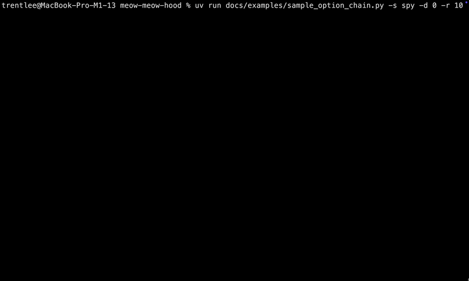

# Meow-Meow-Hood API

A Robinhood API wrapper for fast option market data

## Installation

`uv add meow-meow-hood`\
`pip install meow-meow-hood`

## Why?

If you're using Robinhood as a broker still...\
And if you want to view option market data at a reasonable speed.\
🐈This was made for fun🐈

## Authentication

Ensure you are logged in locally to Robinhood on either:

- Chrome
- Firefox

Auth works by extracting a locally stored access token from your browser data.
By default the client automatically checks Chrome first and then Firefox for a
valid token.
If a stored token is fails auth and `open_browser=True`, it will attempt to
retrieve a fresh token by opening both Firefox and Chrome for a short period then
close them( Warning this will break if Chrome/Firefox are already opened)
This can be disabled on class creation with `extract_token=False`.

You will need to pass in the access token manually if token extraction is
disabled.
Config folder is created at the current working directory labeled `.meow-meow-hood`.
Any files created(cache and env) are placed inside the config folder.

```python
Robinhood(extract_token=False, access_token="...")
```

## Usage

JSON responses are returned as named data classes for easier parsing.\
Examples: `FullQuote`, `OptionInstrument`, `OptionGreekData`, etc.\

```python
@dataclass(frozen=True, slots=True)
class FullQuote(ApiPayloadMixin):
    ask_price: float
    ask_size: int
    bid_price: float
    bid_size: int
    ...
```

(*Refer to [robinhood/api_dataclasses.py](src/robinhood/api_dataclasses.py)
for full implementation details.*)

`OptionRequest` is the main class when requesting option data.

```python
OptionRequest(
    *,
    symbol: str,
    exp_date: str | None = None,
    option_type: Literal['call', 'put'] | None = None,
    strike_price: float | None = None
)
```

Example:

```python
# With context manager
with Robinhood() as rh:
  spy_dates: list[str] = rh.get_expiration_dates("SPY")
  spy_request1 = OptionRequest(symbol="SPY", exp_date=spy_dates[0])
  spy_option_data = rh.get_option_greeks_batch_request(spy_request1)
  for option_request, options in spy_option_data.items():
    print(option_request, len(options))

# No context manager
rh = Robinhood()
spy_quote: FullQuote = rh.get_stock_quotes("SPY")
print(spy_quote.ask_price)
rh.close()


```

## Local caching

This library uses a local SQLite database to cache option
instruments and reduce the amount of requests made per call.\
Cache is validated with a TTL of the next day at 9:30 EDT.\
*See [/docs/design_notes.md](/docs/design_notes.md) for more details*

Example where caching improves speed.

```python
with Robinhood(enable_cache = True) as rh:
  dates = rh.get_expiration_dates("SPY")
  strike_map = rh.get_strike_prices(symbol="SPY",exp_date=dates[0])
  call_request = OptionRequest(
    symbol="SPY",
    exp_date=dates[0],
    option_type="call",
  )
  strikes = strike_map[call_request]
  spy_option_list = []
  # Generate a list of OptionRequests you want to view
  for s in strikes:
    opt_req = OptionRequest(symbol="SPY",exp_date=dates[0],strike_price=s)
    spy_option_list.append(opt_req)

  while True:
    option_data = rh.get_option_greeks_batch_request(spy_option_list)
    for option_request, options in option_data.items():
      option = options[0]
      print(option_request.strike_price, option.ask_price, option.bid_price)
    # Delay should be added to avoid rate limit
    time.sleep(0.25)


```

## Example

Very basic option chain display:



Source can be found [/docs/examples/sample_option_chain.py](/docs/examples/sample_option_chain.py)
To run use

```
uv run docs/examples/sample_option_chain.py
or
python docs/examples/sample_option_chain.py
Args:
-s str[symbol] -d int[index for a list of dates] -r int[option range] -de int[delay]
Default with no args:
"SPY", 0(Nearest expiration date), 10(10 calls/puts based on stock price), 0.25(Seconds)
```

## Trust Me Bro Benchmarks

Benchmark summary for 10 symbols[^benchmark-symbols] and the second nearest
expiration date across 10 runs(~1.6k options returned per run).\
*Network jitter will greatly affect the results but the cache will
always greatly reduce the time to get data back*

`uv run -m benchmarks.benchmark_api_requests`
or
`python -m benchmarks.benchmark_api_requests`

| Metric | Cold Cache | Warm Cache | Improvement |
| --- | ---: | ---: | ---: |
| Average `get_expiration_dates` time | 0.06957s | 0.00013s | 99.81% |
| Average `get_strike_prices` time | 0.31505s | 0.00029s | 99.91% |
| Average `get_option_greeks_batch_request` time | 3.48793s | 1.18787s | 65.94% |
| Average total time per run | 7.33413s | 1.19204s | 83.75% |

`Cold cache` represents a run without any cached option data.
`Warm cache` represents a run with cache hits.

[^benchmark-symbols]: SPY, TSLA, QQQ, NVDA, GOOG, MSFT, AMZN, TSM, META, JPM

## TODO log

See [/docs/todo.md](/docs/design_notes.md) for planned features.
