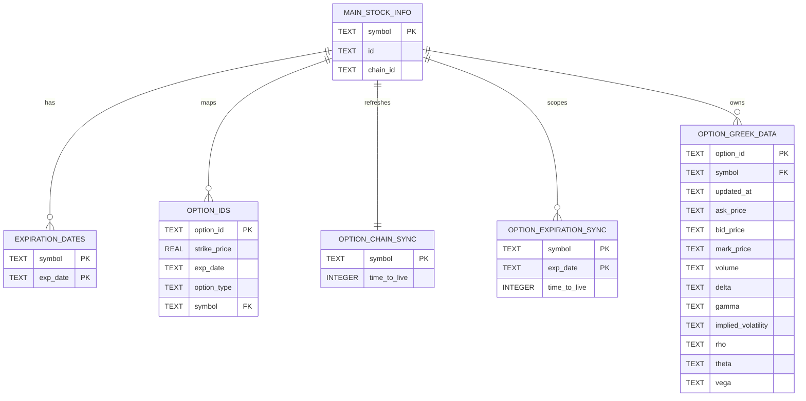
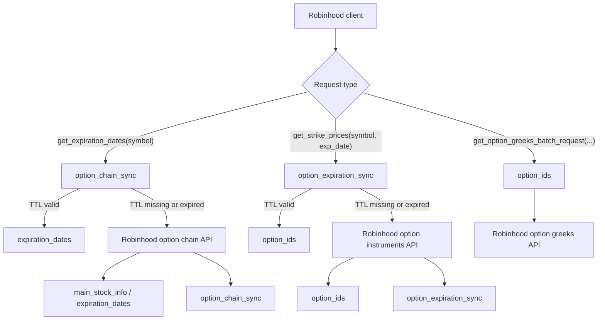

# Database Schema

This project keeps a local SQLite cache in `.meow-meow-config/meow-meow-hood.db`.
The cache stores option chain metadata, option instrument ids, and TTL rows that
determine when a symbol or expiration date needs to be refreshed.

## Entity Relationship Diagram



## Table Roles

- `main_stock_info`: one row per symbol. Stores the Robinhood instrument id and
  the option `chain_id` used to request option chains and instruments.
- `expiration_dates`: cached expiration dates for a symbol. Primary key is the
  pair `(symbol, exp_date)`.
- `option_ids`: cached option instrument ids and their lookup fields. This is
  the table used to answer broad `OptionRequest` lookups from cache.
- `option_chain_sync`: TTL row for symbol-level option chain data.
- `option_expiration_sync`: TTL row for symbol + expiration date cache entries.
- `option_greek_data`: schema placeholder for option greek snapshots. The table
  is created during DB initialization, but the current cache flow does not yet
  write to or read from it.

## Lookup Index

The cache defines one lookup index on `option_ids`:

```sql
CREATE INDEX idx_option_ids_lookup
ON option_ids(symbol, exp_date, option_type, strike_price);
```

That index matches the fields used when `OptionRequest` values are mapped back
to cached option ids.

## Cache Flow



## Practical Notes

- Cache TTLs are set to the next trading day open, `9:30 AM America/New_York`.
- Only broad requests are treated as cachable right now:
  `OptionRequest(symbol=...)` and `OptionRequest(symbol=..., exp_date=...)`.
- Requests narrowed by `option_type` or `strike_price` still reuse cached
  `option_ids`, but they do not create their own sync rows yet.
